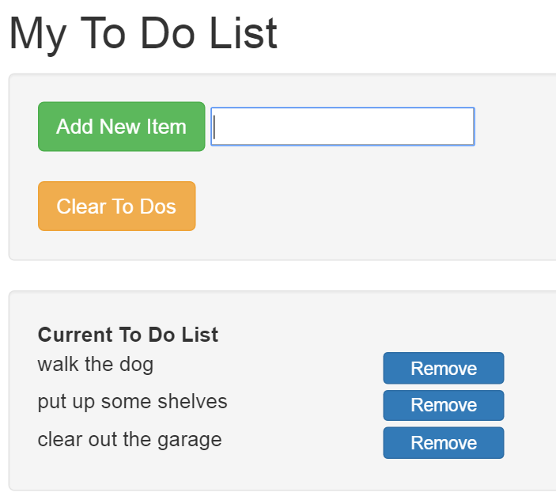

# ToDo-List-MVC5-DI

## First exploration of MVC

This is a simple "To Do List" app using MVC5. The front end uses Bootstrap styling, while the backend uses MVC, StructureMap for DI, and a simple file storage for the "to do" data.



The use of StructureMap allows DI into the controller code, so given greater support to TDD and producing much cleaner code. Do to this the Nuget package `StructureMap.MVC5` has been installed. A default container is initialised as part of the start up routines.

```c
public DefaultRegistry() {
    Scan(
        scan => {
            scan.TheCallingAssembly();
            scan.WithDefaultConventions();
            scan.With(new ControllerConvention());
        });

    For<IObjectStorer>().Use<FileStorer>();
}
```

The controller constructors can then be supplied with interfaces (or property setters can be used).
```c
public ToDoController(IGetToDoList getToDoListQuery, IToDoItemStorage toDoItemStorage)
{
    _toDoItems = new List<ToDoItem>();
    _getToDoListQuery = getToDoListQuery;
    _toDoItemStorage = toDoItemStorage;
}
```
